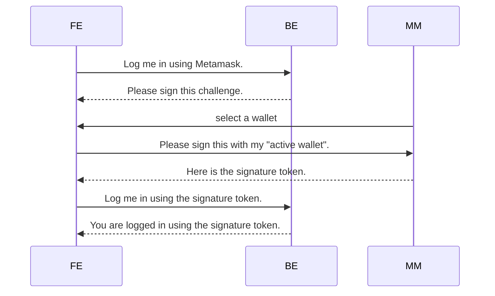

### Web3 authentication

Login sequence

```mermaid
sequenceDiagram
      
FE->>BE: Log me in using Metamask.

    BE-->>FE: Please sign this challenge.
    MM->>FE: select a wallet
    FE->>MM: Please sign this with my "active wallet".
    MM-->>FE: Here is the signature token.
FE->>BE: Log me in using the signature token.
BE-->>FE: You are logged in using the signature token.
```

> Note:  no metamask available on mobile, need develop own wallet

![[2022-08-16 09.49 web3-Auth]]